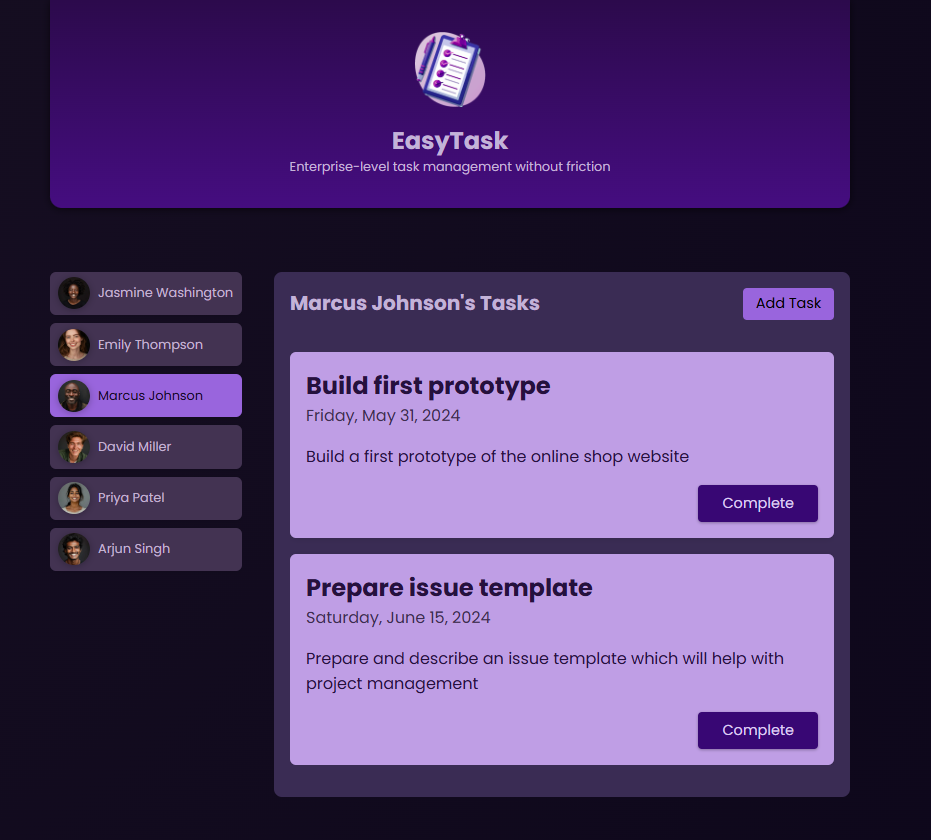

# Manage Tasks

## General View

**Manage Tasks** is a small project in Angular to manage a list of tasks for different users. You can add a new task and complete a task. This project was develop while learning Angular in the following course:

https://www.udemy.com/course/the-complete-guide-to-angular-2/

## Functionalities

- **Add a Task:** Add a new task to the selected user.
- **Complete a Task:** Completes a specific task on the selected user.

## Final Result

View of the application running:

<div align="center">
  
</div>

## How to Run the project

Follow the next steps to run Manage Tasks on your machine:

### Prerequisites

- [Node.js](https://nodejs.org/) (version 20.13.1 or higher)
- [Angular CLI](https://angular.io/cli) (version 18 or higher)

### Steps

1. **Clone the Repository:**

   ```sh
   git clone https://github.com/pedrogomes0008/Manage-Tasks.git
   cd Manage-Tasks

2. **Install Dependecies:**
   
   ```sh
   npm install

3. **Run the Project:**
   
   ```sh
   npm start
